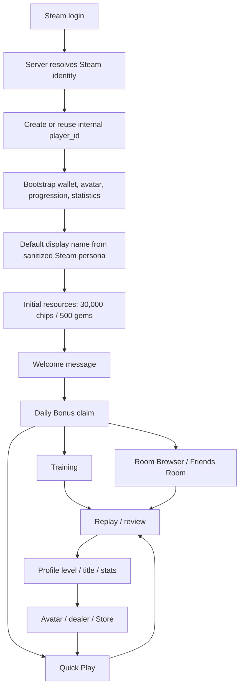
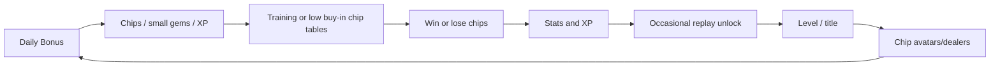
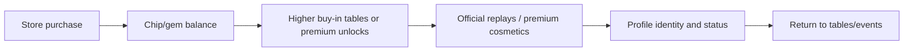
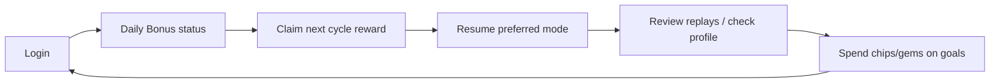
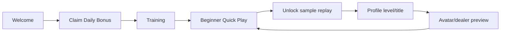

# Product Economy Blueprint

Date: 2026-07-14

Scope: product economy, progression, social, replay, store, and player-loop blueprint. This is a planning document only. It does not change code, server behavior, UI, Steam Payment, or database state.

## 1. Core Resource Definitions

### Chips

Current responsibilities:

- Poker table buy-in.
- Table stack and betting in chip rooms.
- Add Chips transfer from wallet to table stack.
- Avatar purchase for normal character avatars.
- Daily Bonus reward.
- Store mock purchase in dev/local test.

Recommended product role:

- Chips are the main soft currency.
- Chips should be used for ordinary play, ordinary cosmetics, beginner recovery, and low-tier customization.
- Chips should not replace gems for premium replay unlocks, premium cosmetics, event entry, or future paid features.
- Chips must remain server-authoritative in official online rooms.

### Gems

Current responsibilities:

- Replay prices are server-authoritative through one Replay Economy config: official human/room replay `20` gems, AI/training replay `10` gems.
- Gem table buy-in exists in the server/table economy.
- Daily Bonus Day 7 grants `100` gems under Starter Economy.
- Store mock purchase can add gems in dev mode.
- The client receives replay prices in `profile_snapshot.replay_economy`; production unlocks never use a client price constant.

Recommended product role:

- Gems are the premium currency.
- Gems should be used for official replay unlocks, premium avatars/dealers, event entry, and future premium functions.
- Gems should not be used for ordinary poker wagering unless the product intentionally keeps Gem Tables as a separate high-stakes mode.
- If Gem Tables remain, they must be clearly labeled, balance-tested, and kept separate from ordinary chip tables.

### XP

Current responsibilities:

- XP is progression-only.
- XP is not spendable.
- Server Daily Bonus writes XP into `player_progression`.
- Current level formula is `floor(total_xp / 100) + 1`.
- Server hand statistics exist, but this blueprint does not add new XP rewards for hands.

Recommended product role:

- XP should come from Daily Bonus, official hands, achievements, and events.
- XP must not be spendable.
- XP should never affect poker odds, hand strength, table rules, or competitive fairness.
- Whether official hands award XP should be a separate economy patch, not silently added.

### Level

Current rule:

- Server level is derived from `total_xp`.
- Formula: `floor(total_xp / 100) + 1`.
- Client should display server values and not recalculate as authority.

Recommended product role:

- Level should communicate account progression.
- Level can unlock titles, profile cosmetics, and non-gameplay recognition.
- Level should not grant table power.

### Title

Current server title table:

- Level 1: `new_player`
- Level 3: `casual_player`
- Level 5: `table_regular`
- Level 10: `sharp_caller`
- Level 15: `river_hunter`
- Level 20: `card_shark`
- Level 30: `high_roller`
- Level 50: `poker_legend`

Recommended product role:

- Titles are display/progression rewards.
- For Steam Internal Beta, titles should stay Profile-only or low-impact social display.
- Future title rewards can include cosmetic framing, but not gameplay advantages.

### Avatar / Dealer

Current state:

- Default avatar is granted/unlocked by account bootstrap.
- Normal avatar purchase uses chips.
- Dealer cosmetics exist as a visual category.
- Steam avatar is not currently imported as the game avatar.

Recommended product role:

- Default avatars/dealers: free grants.
- Common avatars/dealers: chips.
- Rare avatars/dealers: higher chips or event unlock.
- Premium avatars/dealers: gems or real-money bundle entitlement.
- Event avatars/dealers: earned from limited events.
- Steam avatar should be treated as an optional source/reference, not a replacement for the game avatar system.

## 2. New Player First-Day Flow

Recommended first-day flow:

Final recommended initial resources:

- Initial Chips: `30,000`
- Initial Gems: `500`

Product pricing anchor:

- `100` gems is approximately `1 USD` as an internal product design anchor.
- This is not a code constant and does not determine future Steam regional pricing.

Why not current `10,000 / 0`:

- `10,000` chips only covers two `5,000` buy-ins.
- A new player can lose two sessions and feel forced into Store before understanding the game.
- `0` gems prevents a new player from testing replay unlock, which is one of the product's main differentiators.

Starter Economy rollout rule:

- Starter Economy applies only to newly created players.
- Existing production players must not be reset or automatically topped up to `30,000` chips / `500` gems.
- If old accounts need a compensation grant, use an explicit admin compensation script with audited `wallet_transactions` reasons; do not hide compensation in bootstrap or migration logic.

What a new player should experience on day one:

- Claim Daily Bonus.
- Play Training without risk.
- Enter low-stakes Quick Play.
- Join/create Browser or Friends chip rooms if affordable.
- Unlock at least one official replay or several AI/training replay analyses.
- See Profile level/title progress.
- Preview Store without being forced into purchase.

Bankruptcy prevention:

- Give `30,000` starting chips.
- Add beginner buy-ins at `1,000`, `2,000`, and `5,000`.
- Keep Training free/practice-only.
- Keep Daily Bonus as a recovery path.
- Do not design the first-day flow so payment is required to continue playing.

## 3. Player Core Loops

### A. Free Player Loop

Goal: free players can continue playing through Daily Bonus, Training, and low-stakes tables without mandatory payment.

### B. Paying Player Loop

Goal: paying improves convenience, choice, and cosmetics, but does not grant hand-strength advantages.

### C. Returning Player Loop

Goal: returning players see clear progress and have an obvious next action.

### D. New Player First-Day Loop

Goal: the first session teaches the loop without requiring payment.

## 4. Replay Economy

### Official Human Replay

Recommended price:

- `20` gems per official human replay unlock.

Rules:

- Server authoritative.
- Participant ACL required.
- Encrypted local replay blob.
- Server stores metadata, participants, unlock status, and key material, not full replay JSON.
- Repeated unlock must not charge again.
- Replay key must not be sent at hand-over.

Rationale:

- Official human replay can reveal private cards and full hand history.
- Server unlock protects ordinary users from bypassing the official client flow.
- `20` gems keeps official human replay meaningful while still allowing new players to sample the feature from the `500` starting gem grant.

### AI / Training Replay

Recommended price:

- `10` gems for full AI/training replay analysis.

Why not always free:

- Replay analysis has perceived value.
- A tiny gem cost teaches the premium replay loop.
- It gives new players a reason to understand gems without requiring a purchase.

Important distinction:

- All replay playback is locked until an entitlement exists; there is no free replay category.
- AI/training replay content remains stored locally, while its gem unlock entitlement is server-authoritative.
- Debug `local_dev` may use the explicit local mock path with a previously server-supplied price; production requires the server.

Server authority:

- Official, room, AI, and training replay unlocks are server-authoritative and idempotent.
- For local-only/offline practice, do not pretend local gem spending is secure.

New-player gem experience:

- With `500` starting gems, a player can unlock:
  - twenty-five official human replays at `20` gems each, or
  - fifty AI/training analyses at `10` gems each, or
  - a mixed sample while still preserving premium replay value.
- Day 7's `100` gems gives five official replay unlocks or ten AI/training replay unlocks each completed cycle.

Bundle/monthly pass analysis:

- Replay bundles can be considered after beta telemetry.
- A monthly replay pass should be deferred until replay retention is proven.
- Early beta should keep pricing simple: `20` official, `10` AI/training.

## 5. Bankroll / Chip Economy

Current common buy-ins:

- `1,000`
- `2,000`
- `5,000`
- `10,000`
- `20,000`
- `50,000`

With `30,000` initial chips:

- `5,000` buy-in: six full losses.
- `10,000` buy-in: three full losses.
- `20,000` buy-in: one full loss plus one partial recovery path.
- `50,000` buy-in: not affordable initially.

Beginner table rule:

- Supported chip buy-ins: `1,000`, `2,000`, `5,000`, `10,000`, `20,000`, `50,000`.
- Make Quick Play default to `2,000`.
- If wallet chips are below `5,000`, recommend `1,000`.
- Do not push a new player toward `20,000` or `50,000` tables.

Broke protection:

- Keep Training free.
- Keep Daily Bonus claimable once per day.
- Offer low buy-in tables.
- Consider limited "broke recovery" events later, but avoid unlimited free chips that destroy chip value.

Recovery after bankruptcy:

- Daily Bonus.
- Free Training.
- Beginner tables.
- Store chip packs.
- Future events.

Product rule:

- A player should never be forced to pay to continue playing basic poker.

## 6. Daily Bonus

Current 7-claim cycle:

- Day 1: `1,000` chips, `25` XP
- Day 2: `1,250` chips, `25` XP
- Day 3: `1,500` chips, `25` XP
- Day 4: `2,000` chips, `25` XP
- Day 5: `2,500` chips, `25` XP
- Day 6: `3,000` chips, `25` XP
- Day 7: `6,000` chips, `50` XP, `100` gems

This is a 7-claim cycle, not a consecutive-login streak. Missing days should not reset progress.

### Conservative Plan

- Keep current reward table.
- Total cycle: `12,000` chips, `200` XP, `5` gems.
- Best for protecting currency value.
- Weakness: early days feel small relative to a `5,000` buy-in.

### Balanced Plan

- Day 1: `1,000` chips, `25` XP
- Day 2: `1,250` chips, `25` XP
- Day 3: `1,500` chips, `25` XP
- Day 4: `2,000` chips, `25` XP
- Day 5: `2,500` chips, `25` XP
- Day 6: `3,000` chips, `25` XP
- Day 7: `6,000` chips, `50` XP, `100` gems
- Total cycle: `17,250` chips, `200` XP, `100` gems.
- Best match for a `30,000` starting bankroll.

### Generous Plan

- Day 1: `2,000` chips, `25` XP
- Day 2: `3,000` chips, `25` XP
- Day 3: `4,000` chips, `25` XP
- Day 4: `5,000` chips, `25` XP
- Day 5: `6,000` chips, `25` XP
- Day 6: `8,000` chips, `25` XP
- Day 7: `12,000` chips, `50` XP, `10` gems
- Total cycle: `40,000` chips, `200` XP, `10` gems.
- Best for aggressive retention testing.
- Risk: devalues chips and gems too early.

Recommended plan:

- Use the Balanced Plan for Steam Internal Beta.
- Do not add Day 1 gems.
- Keep Day 7 gems at `100`.

## 7. Nickname System

Definitions:

- Steam Persona Name: the mutable name from Steam.
- Game Display Name: the in-game nickname shown in Texas Hold'em.
- Internal Player ID: server-generated player ID used as the database identity.
- SteamID: external identity used only for Steam mapping.

Recommended rules:

- First login defaults Game Display Name to sanitized Steam Persona Name.
- Internal Player ID is always independent from SteamID.
- First rename is free.
- Later renames have a 30-day cooldown.
- Name length: 3-16 visible characters.
- Trim whitespace.
- Reject control characters.
- Reject reserved system names.
- Add profanity filtering.
- Steam name changes must not overwrite a customized Game Display Name.
- Store both `steam_persona_name` and `display_name`.
- Add `nickname_history` and `renamed_at` for audit/moderation.

Duplicate names:

- Recommended: allow duplicate display names for simplicity, because internal player ID is unique.
- If uniqueness is required later, append a short discriminator such as `Luna#4821`.
- For Internal Beta, do not require global uniqueness.

Final recommendation:

- Allow duplicates.
- Display profile/player ID context where needed.
- Add moderation and rename cooldown before public release.

## 8. Social / Chat

Current real state:

- Friends Room is real room-code/private table functionality.
- Social page is currently a placeholder modal.
- No server friend graph exists.
- No private chat exists.
- No server-authoritative room chat protocol exists.

### Phase 1: Internal Beta Minimum

- Social page clearly says Coming Soon.
- Implement Room Chat MVP only if chat is needed for the beta.

Room Chat MVP requirements:

- `room_chat_send`
- `room_chat_message`
- Only room participants can send/read.
- Length limit.
- Rate limit.
- Mute.
- Basic profanity/filter rules.
- No persistence.

Priority: optional before Internal Beta if Social is labeled honestly; required if Social is marketed as a feature.

### Phase 2: Steam Social Layer

- Steam Friends invite.
- Online presence.
- Room invite.

Priority: defer until after Internal Beta.

### Phase 3: Game Social Layer

- Game friend graph.
- Direct messages.
- Block/report.
- Persistent moderation tooling.

Priority: defer.

## 9. Store / Monetization

Current true state:

- Store is mock/dev-only.
- Real Steam MicroTxn is not implemented.
- Production must use `ALLOW_MOCK_PURCHASES=false`.

Future product catalog, relative tiers only:

### Chip Packs

- Small: recovery / low-stakes refill.
- Medium: several standard buy-ins.
- Large: high bankroll convenience.

### Gem Packs

- Small: replay sampling and one premium item.
- Medium: replay-heavy users and rare cosmetics.
- Large: premium/event-focused users.

### Starter Pack

- Chips.
- Gems.
- Exclusive avatar or dealer.
- One-time purchase.

Payment requirements:

- Do not set final USD prices in this blueprint.
- Server must create order records.
- Server must finalize purchases.
- Delivery must be idempotent.
- Refund/chargeback must write reversing wallet transactions.
- Steam MicroTxn credentials must stay server-only.

Can defer before Internal Beta:

- Real Steam MicroTxn.
- Refund automation UI.
- Purchase bundles.
- Subscription/monthly pass.

Cannot defer before any monetized build:

- Server order table.
- Idempotent delivery.
- Production mock-purchase disable.
- Transaction audit trail.

## 10. Avatar / Dealer Economy

Recommended categories:

### Common

- Price: `2,500-7,500` chips.
- Source: chips, default grants.

### Rare

- Price: `10,000-25,000` chips or `3-5` gems.
- Source: chips, gems, achievements, limited events.

### Premium

- Price: `10-30` gems or bundle entitlement.
- Source: gems, Store, Starter Pack.

### Event

- Price: not directly purchasable during the event.
- Source: activity completion, event leaderboard, seasonal grant.

Steam avatar:

- Use only as an initial/profile reference if desired.
- Do not replace the game avatar economy.
- Do not hotlink or depend on Steam avatar for table identity without caching/fallback.

## 11. Exit / Leave Table UX

Unified modal rules:

### Leave Table

- Pre-hand: full table stack refund.
- Active hand: auto-fold.
- Committed chips stay in pot.
- Remaining stack cashes out.
- Disconnect/force quit uses reconnect grace and server settlement.

### Exit Game

- Not at table: simple confirmation.
- At table: run Leave Table settlement first, then quit.
- Force quit/disconnect: server authoritative recovery handles funds.

Recommended shared modal component:

- Leave Table.
- Exit Game.
- Delete Replay.
- Purchase Confirmation.
- Rename Confirmation.

## 12. Product Rule Conflicts

Current conflicts between code and recommended product rules:

- Replay Economy E2 is aligned; future work should retain the single server pricing source.
- Steam persona currently can overwrite `display_name` on hello.
- Social page is placeholder.
- Room Chat is not implemented as a server feature.
- Store is mock/dev-only.
- Table exit uses Godot `ConfirmationDialog`, not the recommended custom modal.
- Gem Table should be explicitly confirmed or cut before broader testing.

## 13. Must Fix Before Internal Steam Build

True blockers:

- Stabilize and implement new-player initial Chips/Gems values.
- Align replay pricing across client/server/local paths.
- Separate Steam Persona Name from Game Display Name.
- Hide or clearly label Store mock/dev-only state.
- Make Social status honest: Coming Soon or room chat MVP.
- Add basic custom Leave Table / Exit Game modal copy.
- Keep Quick / Browser / Friends authoritative online flow stable.
- Clearly document Steam auth mode if it remains `disabled` or `optional`.

## 14. Can Defer

- Steam MicroTxn.
- Friend graph.
- Private chat.
- Persistent chat.
- Leaderboards.
- Achievements.
- Cloud Save.
- Replay subscription/monthly pass.
- Advanced moderation tooling.
- Advanced Steam invites/lobbies/P2P.

## 15. Final Recommended Product Rules

- Initial Chips: `30,000`
- Initial Gems: `500`
- Official human replay price: `20` gems
- AI / Training replay analysis price: `10` gems
- Daily Bonus: Balanced Plan
- Nickname rule: Steam persona seeds the first display name, then game display name is independent.
- Social MVP: Social Coming Soon plus optional room chat MVP.
- Store Internal Beta state: mock hidden or clearly dev-only; no real purchases.
- Gem Table: keep only if explicitly positioned as a premium/high-stakes mode; otherwise hide for early beta.
- Beginner table buy-ins: `1,000`, `2,000`, `5,000`

Steam Internal Beta patch order:

1. E1: Initial Chips/Gems, Daily Bonus baseline, beginner bankroll rules.
2. E2: Replay pricing alignment and AI replay `10` gems.
3. E3: Nickname separation and rename.
4. E4: Store mock hide/dev gate.
5. E5: Social Coming Soon and room chat MVP.
6. E6: Custom modal for Leave Table / Exit Game.

## 16. Minimal Patch Plan

### Patch E1: Initial Resources and Beginner Bankroll

Scope:

- Change authoritative initial chips/gems.
- Align local fallback defaults.
- Select Daily Bonus plan.
- Add beginner buy-in rules/config.

Likely files:

- `server/src/db/wallet_repository.ts`
- `scripts/data/player_profile.gd`
- `scripts/screens/home_lobby_screen.gd`
- server table config files

DB migration:

- Not required for new players.
- Optional one-time grant/backfill if existing test accounts should receive the new starter delta.

Tests:

- New player gets `30,000` chips and `500` gems.
- Existing players are not reset.
- Beginner buy-ins appear and are affordable.
- Daily Bonus values match selected plan.

Risk:

- Existing test balances may look inconsistent unless old accounts are handled explicitly.

### Patch E2: Replay Pricing Alignment

Scope:

- Official/room replay price is `20` gems.
- AI/training replay price is `10` gems.
- Client display consumes server `profile_snapshot.replay_economy`; no replay price is hardcoded in Godot.
- Local replay files remain local, but production unlock entitlement and gem spending are server-authoritative.

Likely files:

- `server/src/room_manager.ts`
- `scripts/data/player_profile.gd`
- `scripts/services/profile_service.gd`
- `scripts/replay/replay_repository.gd`
- `scripts/screens/home_lobby_screen.gd`

DB migration:

- `009_replay_economy` adds explicit `replay_type` to `replay_index` and backfills existing official records.

Tests:

- Official replay unlock costs `20` gems.
- Repeated official unlock does not charge.
- AI/training replay unlock costs `10` gems on first access; the same replay remains unlocked without another charge.
- Offline/local behavior is explicit and does not pretend to be server-secure.

Risk:

- Mixing local replay and official encrypted replay can confuse users if UI copy is not precise.

### Patch E3: Nickname Separation and Rename

Scope:

- Add Steam Persona Name separate from Game Display Name.
- Add first rename and cooldown policy.
- Prevent Steam persona changes from overwriting customized names.

Likely files:

- `server/src/db/player_repository.ts`
- `server/src/room_manager.ts`
- `server/src/protocol.ts`
- `scripts/services/profile_service.gd`
- `scripts/screens/home_lobby_screen.gd`

DB migration:

- Add `steam_persona_name`, `display_name_customized_at`, `renamed_at`.
- Optional `nickname_history`.

Tests:

- New Steam user gets sanitized Steam persona as default.
- Changed Steam persona does not overwrite customized game name.
- First rename succeeds.
- Cooldown blocks repeated rename.

Risk:

- Existing users may already have Steam persona stored as display name. Migration must preserve current display names.

### Patch E4: Store Mock Hide / Dev Gate

Scope:

- Hide or dev-label Store mock purchase UI in external builds.
- Enforce `ALLOW_MOCK_PURCHASES=false` in production.
- Keep local dev tools available behind explicit dev mode.

Likely files:

- `server/src/config.ts`
- `server/src/room_manager.ts`
- `scripts/screens/home_lobby_screen.gd`
- `scripts/services/store_mock_service.gd`

DB migration:

- Not required.

Tests:

- Production config rejects mock purchase.
- Store UI does not imply real purchases are live.
- Dev mode still supports mock testing.

Risk:

- If hidden too aggressively, testers may have no recovery path without Daily Bonus/beginner tables.

### Patch E5: Social Coming Soon + Room Chat MVP

Scope:

- Make Social placeholder honest.
- Optionally implement room chat MVP.

Likely files:

- `server/src/protocol.ts`
- `server/src/room_manager.ts`
- `scripts/network/poker_protocol.gd`
- `scripts/network/poker_ws_client.gd`
- `scripts/screens/home_lobby_screen.gd`
- `scripts/screens/poker_table_screen.gd`

DB migration:

- Not required for non-persistent room chat.

Tests:

- Non-participants cannot chat in a room.
- Rate limit works.
- Length limit works.
- Basic filter works.
- Social page does not imply friends/DM if absent.

Risk:

- Chat requires moderation even if non-persistent.

### Patch E6: Custom Modal for Leave Table / Exit Game

Scope:

- Replace table `ConfirmationDialog` usage with shared custom modal.
- Add state-specific settlement language.
- Reuse modal style for purchases, rename, delete replay later.

Likely files:

- `scripts/screens/poker_table_screen.gd`
- `scripts/screens/home_lobby_screen.gd`
- new shared modal component if desired

DB migration:

- Not required.

Tests:

- Pre-hand modal says full refund.
- Active-hand modal says auto-fold and committed chips stay in pot.
- Exit Game at table runs settlement first.
- Timeout does not assume wallet settlement.

Risk:

- UI-only wording must stay aligned with server settlement behavior.
